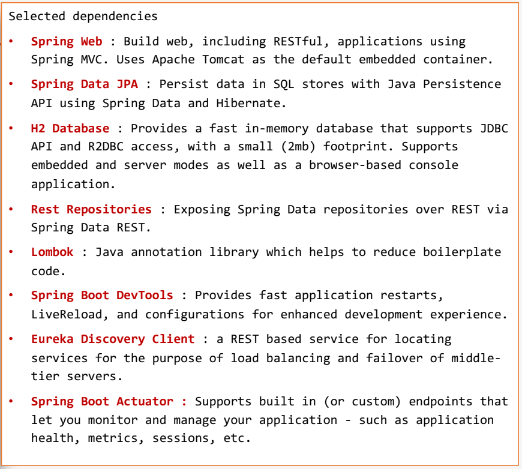
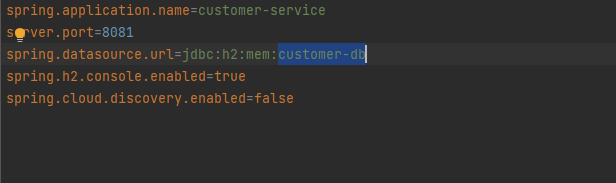

# Mise en oeuvre d'une architecture Micro-Services E-Commerce

Création d'une application basée sur une architecture micro-service E-commerce qui
permet de gérer les factures contenant des produits et appartenant à un client.

## Architecture:

##### Lors de la creation de notre projet ,on aurra besoin d'installer les dependances suivantes:

Travail à faire :

1. Créer le micro-service customer-service qui permet de gérer 
les clients  
##### L'entite JPA Customer

#### Creation d'une projection
les projections servent à personnaliser les données extraites de la
base de donnée sans extraire l'ensemble complet des attributs de
l'entité ce qui permet d'améliorer la performances.

#### L'interface JPA Repository basee sur Spring Data CustomerRepository

#### Insertion de quelques customers

#### Configuration le fichier propertise

#### Consulter la db

#### Consulter les listes des customers avec la projection

2. Créer le micro-service inventory-service qui permet de gérer 
les produits
##### L'entite JPA Customer

#### L'interface JPA Repository basee sur Spring Data ProductRepository

#### Insertion de quelques products

#### Configuration le fichier propertise

#### Consulter la db

### Consulter les listes des products

3. Créer la Gateway Spring cloud Gateway
4. Configuration statique du système de routage
5. Créer l'annuaire Eureka Discrovery Service
6. Faire une configuration dynamique des routes de la gateway
7. Créer le service de facturation Billing-Service en utilisant Open Feign
8. Créer un client Web Angular (Clients, Produits, Factures)